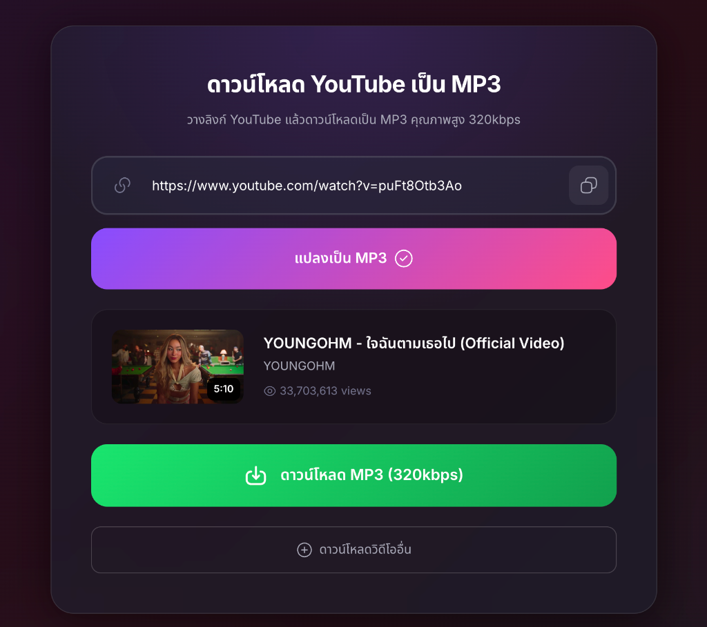

# YouTube to MP3/MP4 Downloader



A Progressive Web App (PWA) for converting and downloading YouTube videos to high-quality MP3 (320kbps) or MP4 (up to 4K). Supports YouTube Shorts with real-time download progress.

## Features

- **Dual Format Support**: Download as MP3 (320kbps audio) or MP4 video (720p, 1080p, 4K+)
- **YouTube Shorts Support**: Convert YouTube Shorts to MP3 or MP4
- **Progressive Web App**: Install on desktop and mobile devices for offline-like experience
- **Real-time Progress**: Visual progress bar showing download and conversion phases
- **Lightning Fast**: Optimized for quick conversions
- **Free & No Registration**: No signup required, completely free to use
- **Mobile Responsive**: Works on all devices
- **Modern UI**: Clean, dark-themed interface with smooth animations

## Live Demo

Visit: https://ytmp3.coinbx.com/

## Prerequisites

- Node.js (v14 or higher)
- npm or yarn

## Installation & Usage

### 1. Clone the Repository

```bash
git clone https://github.com/Gamezxz/downloadyoutube.git
cd downloadyoutube
```

### 2. Install Dependencies

```bash
npm install
```

### 3. Create Cookies File (Important!)

YouTube requires authentication for downloads. You need to export cookies from your browser:

#### Steps:

1. **Install Browser Extension**
   - Chrome: [Get cookies.txt LOCALLY](https://chrome.google.com/webstore/detail/get-cookiestxt-locally/cclelndahbckbenkjhflpdbgdldlbecc)
   - Firefox: [cookies.txt](https://addons.mozilla.org/en-US/firefox/addon/cookies-txt/)

2. **Login to YouTube**
   - Go to https://www.youtube.com
   - Login with your Google Account

3. **Export Cookies**
   - Click the extension icon
   - Select "Export" or "Current Site"
   - Save the file as `cookies.txt`

4. **Place File in Project**
   - Place `cookies.txt` in the root directory (next to package.json)

### 4. Run the Server

```bash
npm start
# or
npm run dev
```

### 5. Open the Application

Open your browser and navigate to http://localhost:3000

## Project Structure

```
downloadyoutube/
├── package.json
├── server.js              # Express server with API endpoints
├── cookies.txt           # YouTube cookies (create your own)
├── README.md
├── .gitignore
└── public/
    ├── index.html         # Main application page
    ├── app.js            # Frontend JavaScript
    ├── styles.css        # Styling
    ├── manifest.json     # PWA manifest
    ├── sw.js             # Service worker
    ├── favicon.png       # App icon
    ├── apple-touch-icon.png
    ├── og-image.png      # Open Graph image
    ├── screenshot.png    # Screenshot for README
    ├── privacy-policy.html    # Privacy policy page
    ├── terms-of-use.html      # Terms of use page
    └── copyright-claims.html  # DMCA/copyright page
```

## API Endpoints

| Method | Endpoint | Description |
|--------|----------|-------------|
| GET | `/api/info?url=...` | Get video information |
| GET | `/api/download?url=...&format=...&quality=...` | Download as MP3 or MP4 |
| GET | `/api/status` | Check cookies status |
| POST | `/api/reload-cookies` | Reload cookies |

### Download Parameters

- `url`: YouTube video URL
- `format`: `mp3` or `mp4` (default: `mp3`)
- `quality`: For MP4 - `720`, `1080`, or `best` (default: `1080`)

## Technology Stack

- **Backend**: Node.js with Express
- **Video Processing**: @distube/ytdl-core, fluent-ffmpeg, ffmpeg-static
- **Frontend**: Vanilla JavaScript with modern ES6+
- **PWA**: Service Worker with offline support
- **Styling**: CSS3 with animations and responsive design

## Important Notes

- **Cookie Expiration**: YouTube cookies typically expire after a few weeks. Export fresh cookies if you encounter errors.
- **Legal Use Only**: Use this tool for downloading copyright-free content, Creative Commons, Public Domain, or content you own.
- **Do Not Share Cookies**: The `cookies.txt` file contains your session data. Never share it with others.
- **Private/Age-Restricted Videos**: Ensure videos are not private or age-restricted.

## Legal Disclaimer

This website is NOT affiliated with YouTube, Google, or any of their subsidiaries.

**Usage Terms:**
- This tool is intended for downloading **copyright-free content** only
- Users are **solely responsible** for ensuring downloaded content does not infringe on others' copyrights
- Downloading copyrighted content without permission may violate laws in **your country**
- The service provider is **not liable** for any illegal use by users
- This website **does not store any files** on our servers - files are deleted immediately after download
- **Age Requirement**: You must be at least 18 years old to use this service

## Troubleshooting

### Error: "YouTube requires authentication"
Create a `cookies.txt` file following the instructions above.

### Error: "Status code: 403"
Cookies have expired. Export new cookies from your browser.

### Video not loading
Check that the video is not private or age-restricted.

### Download not starting
- Verify the video URL is correct
- Check that cookies are valid
- Ensure the server is running

## Development

To run in development mode:

```bash
npm run dev
```

The server will run on port 3000 by default.

## Contributing

Contributions are welcome! Please feel free to submit a Pull Request.

## License

This project is open source and available under the MIT License.

## Donation

If you find this project helpful, consider donating to support server costs.

**EVM Wallet Address:** `0x947Fc02E2CaF6B5a2633b40471949A09010173C0`

Supports all EVM chains: ETH, BSC, Polygon, Arbitrum, Optimism, Avalanche

## Credits

Built with ❤️ using open-source technologies.

## Links

- **GitHub**: https://github.com/Gamezxz/downloadyoutube
- **Live Demo**: https://ytmp3.coinbx.com/
- **DMCA / Copyright**: dmca@coinbx.com